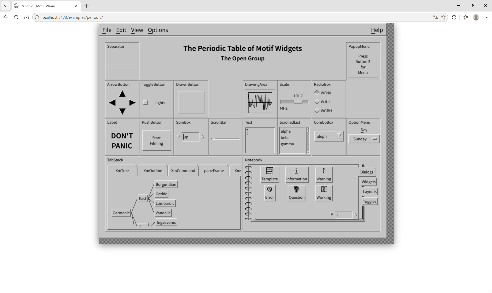

# MotifWasm

OpenMotif 2.3.8 (libXm) compiled to WebAssembly via em-x11, with the classic Periodic Table of Widgets demo.



## Quick start

```bash
# One-time: approve esbuild postinstall (pnpm 11 blocks build scripts by default)
pnpm approve-builds

# Install deps
pnpm install

# Build libXm + periodic demo
pnpm build

# Dev server (default Vite port 5173)
pnpm dev
```

Open `http://localhost:5173/examples/periodic/`.

## Prerequisites

- **WSL** (Linux required — `emcmake`, `bash`, `gcc`)
- Emscripten SDK (`emsdk`), activated
- em-x11 sibling directory (or set `EM_X11_SRC`)
